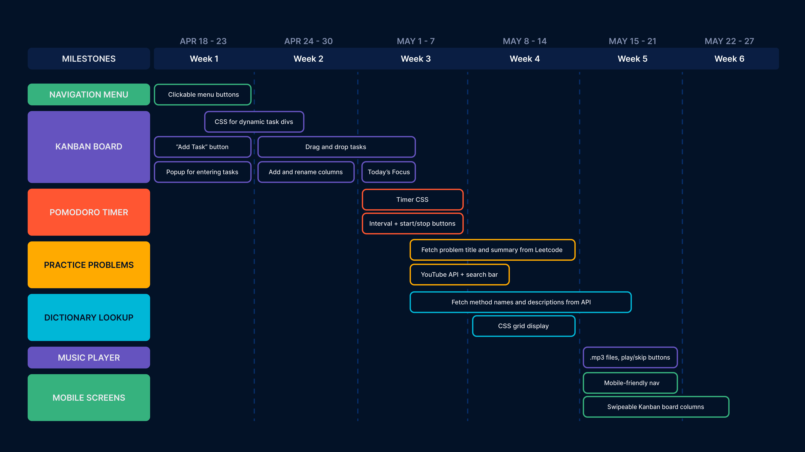
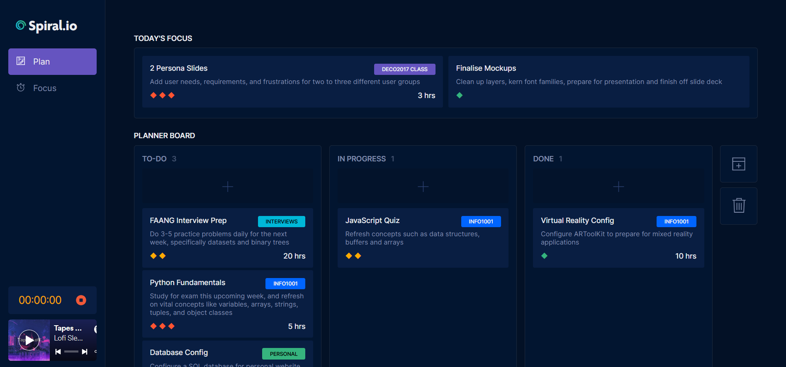
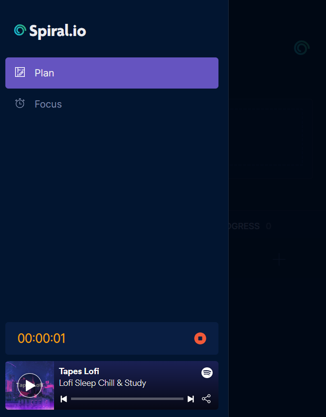
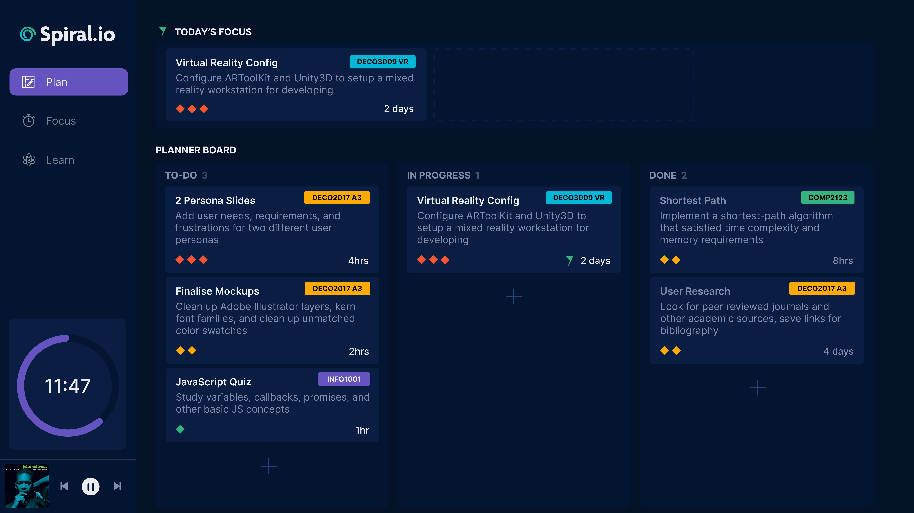
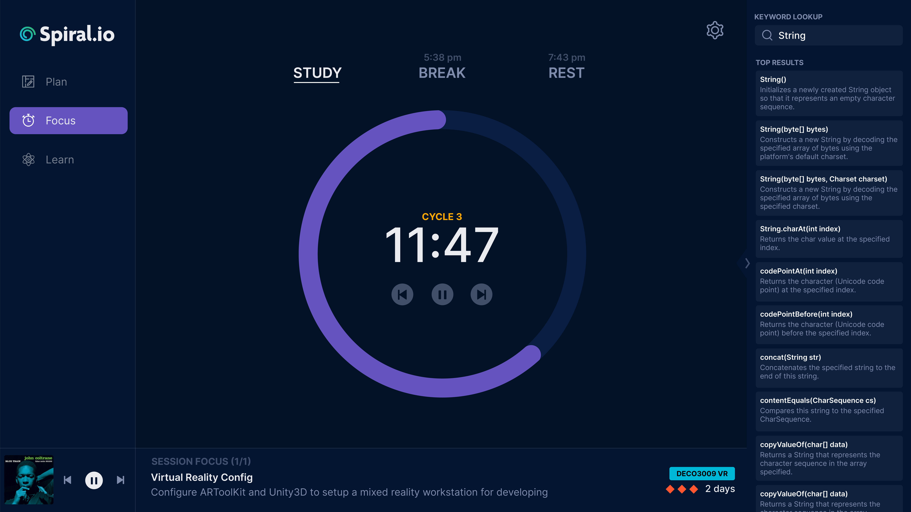
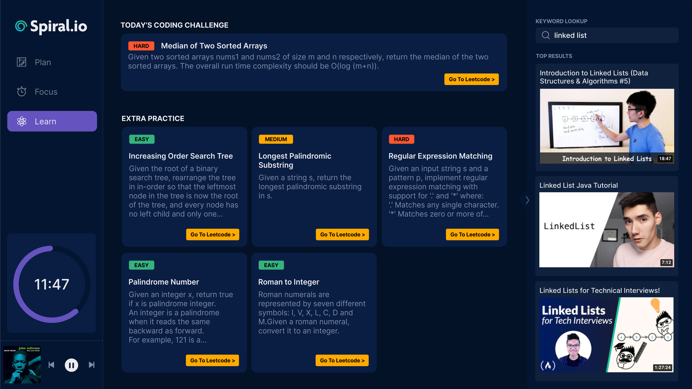

# Spiral.io: A Study Tool for Programming Students
*Developed by Neesha Chockalingam*

This is a document detailing the development process and implementation iterations for Spiral.io, a study tool for computer science and programming students.

I've structured this document based on the proposed features mentioned in my development roadmap, which I originally created before the start of this assessment:



The sections are as follows (in order):
1. Navigation Menu
2. Kanban Board
3. Pomodoro Timer & Dictionary
4. Practice Problems


# Introduction
#### PROPOSAL
The initial pitch for Spiral.io was a tool designed to maximise coding productivity,and minimise burnout. It also planned to offer coding challenges to warm-up and practice for coding interviews as well as a built-in ask tracker and keyword lookup to streamline daily workloads.

#### FINAL IMPLEMENTATION
Aside from some minor site modifications, the final website implementation stayed consistent with the intial mockup designs, and offers an aesthetically consistent and smooth use experience for study prep. 

#### OUTCOME
Spiral.io is now a polished study resource that is carefully designed in alignment with modern development tools such as GitHub and Jira, with design practices that allow computer science students to mentally compartmentalise their work separate from other facets of their life.




# 1 - Navigation Menu


The navigation menu underwent several minor changes between the mockup and final design process, some of which included:
* __Removing margins from navigation buttons__ ensured that onclick() events were fired consistently, as the original hitbox was quite narrow users often clicked on the bleed region between the buttons during page navigation.
* __Embedding a Spotify music player__ ensured fast site load times as opposed to a vanilla music player. I originally had implemented a simple music player without the use of an external iframe, but wanted to include a variety of tracks so users wouldn't get annoyed by the repetition. This would have been problematic to implement without Spotify, as the repository wouldn't have been as lightweight.
* __Attaching a stopwatch to the navbar__ allowed users to track their efficiently across both pages, and meant that the stopwatch could be used synchronously with the Pomodoro timer. After user testing, I found that many students set stopwatches for themselves to track their overall productivity, so it made sense to embed the timer into the navbar itself. I also removed the Pomodoro timer overlay (see Section 2), as I felt it added too much clutter to the interface paired with the stopwatch.

As per my mockups, I had to implement a mobile-exclusive navigation bar, to ensure the navigation menu would become collapsible at a narrow enough screen width. I also had to change the display type to ensure it would float over the site elements instead of rest to the left on desktop devices.


# 2 - Kanban Board

The Kanban board stayed almost entirely consistent with my original mockups, though there were some challenges with the drag and drop implementation, as well as label categorisation, as I decided to code the Kanban board without the use of external libraries. 

Some small changes included:
* __Moving the "Add Task" buttons to the top of each board__ ensured that users wouldn't have to scroll to the bottom of the board if they had a large amount of tasks added.
* __Adding fixed action buttons__ to the end of the board clearly defined the expected interaction patterns, as opposed to the hover states I had planned for in the mockups. This also translated well to mobile, as hover states would have become problematic from a UX standpoint. In the future I'd want to convert the buttons to ```display:sticky```, so users don't have to scroll all the way to the end when they have a large number of boards.

A big challenge I had was color-coding category labels, as I wanted categories with the same name to be the same color. To implement this, I had to create a new category object and validate each name during the ```addTask()``` function:

```
let categoryObj;
  let catMap = categoryList.map(cat => cat.name);
  //If the category doesn't exist yet...
  if(!catMap.includes(task.taskCategory)) {
    categoryObj = {
      name: task.taskCategory,
      labelColor: colorList[colorPos],
    };
    ...
```

For each unique label, I appended a programmatically-calculated label color to the category object, so any future category with the same name would reference that same color label.


# 3 - Pomodoro Timer & Dictionary



The Pomodoro Timer also stayed quite consistent with my mockups, though there were also a few modifications:
* __Moving the position for the time settings__ allowed the design to scale to a responsive layout. I felt like the settings icon was too detached from the timer wrapper, and embedding it within the buttons themselves implied that the times themselves could be edited.
* __Cross-page support for the "Today's Focus" items__ wasn't implemented as I ran out of time and wanted to focus on more essential aspects of the site instead. In the future, I think this would be a valuable feature to implement, as it helps with focus during longer study sessions.

The timer was also tough to make responsive, as changing the element size itself broke the precise padding for the stroke-dasharray calculations I had made. 

```
//Coding the progress indicator for the timer using stroke-dasharray
circle {
  fill: none;
  stroke: variables.$helpPurple;
  stroke-width: 40px;
  stroke-dasharray: 1159;
  stroke-dashoffset: 1159;
  transition: stroke-dashoffset 1s linear;
}
```

After much tinkering, I decided the best way to ensure nothing broke was to dynamically calculate the timer padding proportionally to the screen width, and retain the actual size of the timer itself.

As for the dictionary, I implemented it stylistically the way I had intended, however after much online research I failed to find an API for coding keywords that was free and worked the way I intended. Ideally, I would have liked an API that had definitions for popular methods and functions for frontend languages, but this didn't seem to exist yet. So instead, I opted for a normal dictionary API. 


# 4 - Practice Problems



After much deliberation, I opted to exclude the "Learn" section from my website. It had a few useful features that I thought would benefit programming students, including coding practice and programming videos, but there were a few reasons I didn't add it in:
1. The actual functionality of the webpage simply linked to external resources, and if users wanted to use those websites, they would likely just navigate to the page on the internet themselves
2. The features weren't an integral part of the design brief, and I wanted to focus on polishing more important parts of the website first

For this reason, the final website prototype only has 2 pages, instead of 3 as originally proposed.


# References

#### Icons
Noun Project: Free Icons & Stock Photos for Everything. (2022). The Noun Project. Retrieved June 3, 2022, from https://thenounproject.com/

#### Color Palette
Color. (2021). Retrieved from https://atlassian.design/foundations/color

#### Time Calculations Library
Chernev, I. (2020). Moment.js | Home. Moment.Js. Retrieved June 3, 2022, from https://momentjs.com/

